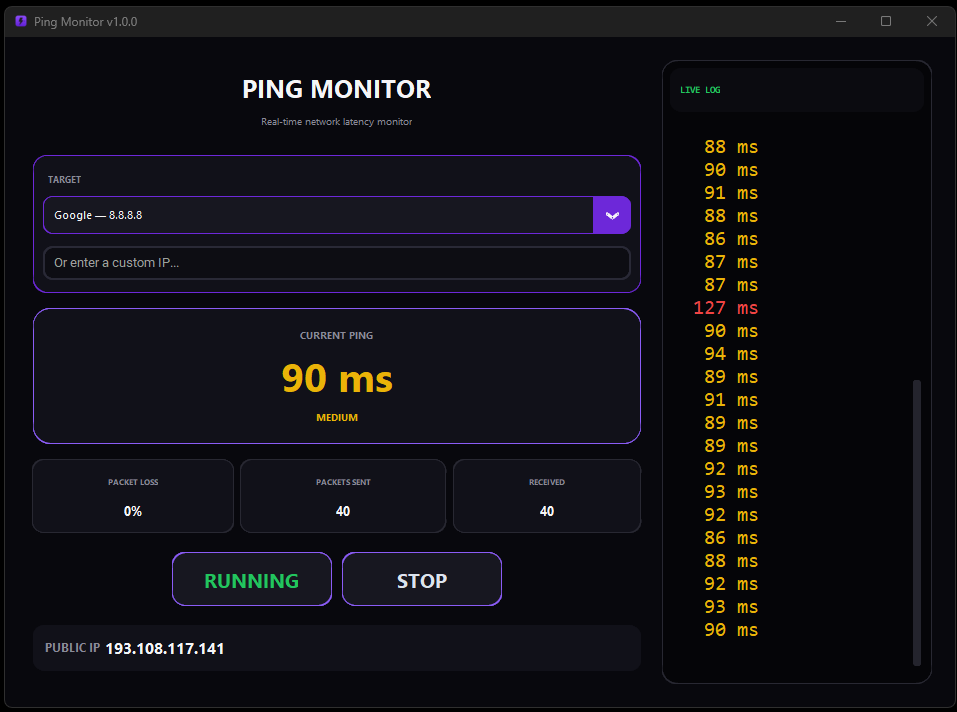

# Ping Monitor

**مانیتور سبک و لحظه‌ای پینگ و Packet Loss برای ویندوز**

[🇮🇷 فارسی](README.fa.md) | [🇬🇧 English](README.md)



## معرفی

**Ping Monitor** یک ابزار دسکتاپ سبک برای ویندوز است که وضعیت اتصال شبکه و تأخیر (Latency) را به‌صورت لحظه‌ای نمایش می‌دهد.

این برنامه برای بررسی سریع کیفیت اتصال به سرورها و آدرس‌های IP مختلف طراحی شده و در کنار مقدار پینگ، تعداد بسته‌های ارسال‌شده، تعداد بسته‌های دریافت‌شده و Packet Loss را نمایش می‌دهد.

## امکانات

- نمایش لحظه‌ای پینگ
- نمایش Packet Loss
- شمارش Packetهای ارسال‌شده و دریافت‌شده
- لاگ زنده از نتایج Ping
- نمایش Public IP
- چند مقصد آماده برای تست
- امکان وارد کردن IP دلخواه
- دکمه‌های START و STOP
- اجرای Ping بدون باز شدن پنجره CMD
- رابط کاربری تیره و ساده
- نسخه Portable بدون نیاز به نصب
- بدون نیاز به نصب Python روی سیستم مقصد

## مقصدهای آماده

| نام | IP |
|---|---|
| Google | `8.8.8.8` |
| Cloudflare | `1.1.1.1` |
| Quad9 | `9.9.9.9` |
| OpenDNS | `208.67.222.222` |
| MyTeamSpeak | `46.38.138.68` |
| Soft98 | `79.127.127.35` |
| Server Minecraft | `185.141.105.216` |
| CS2 Server | `138.201.131.228` |

همچنین می‌توانید IP دلخواه خودتان را وارد کنید.

## دانلود

نسخه قابل حمل برنامه از بخش **Releases** گیت‌هاب منتشر می‌شود.

برای استفاده:

1. فایل ZIP را دانلود کنید.
2. آن را Extract کنید.
3. فایل `Ping Monitor.exe` را اجرا کنید.

نیازی به نصب Python یا نصب‌کننده جداگانه نیست.

## اجرا از سورس

برای اجرای نسخه Python، ابتدا Python را نصب کنید و سپس وابستگی‌ها را نصب کنید:

```bash
pip install -r requirements.txt
```

سپس:

```bash
python main.py
```

## ساخت نسخه Portable

برای ساخت EXE در ویندوز، فایل زیر را اجرا کنید:

```text
build_release.bat
```

همچنین پروژه دارای GitHub Actions برای ساخت خودکار نسخه ویندوز است.

## تکنولوژی

- Python
- CustomTkinter
- PyInstaller

## ساختار پروژه

```text
PingMonitor/
├── .github/
│   └── workflows/
│       └── build.yml
├── screenshots/
│   └── main.png
├── main.py
├── PingMonitor.ico
├── build_release.bat
├── requirements.txt
├── README.md
├── README.fa.md
├── LICENSE
└── .gitignore
```

## لایسنس

این پروژه تحت مجوز **MIT** منتشر شده است. برای جزئیات کامل فایل [`LICENSE`](LICENSE) را ببینید.

## لینک‌ها

- [نسخه انگلیسی README](README.md)
- [Releases](https://github.com/Hadi4K/PingMonitor/releases)
- [Repository](https://github.com/Hadi4K/PingMonitor)
